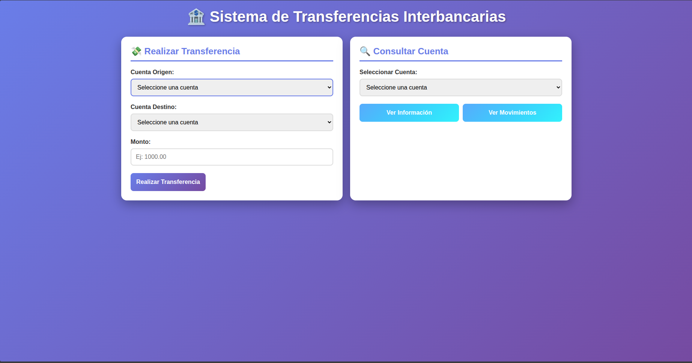
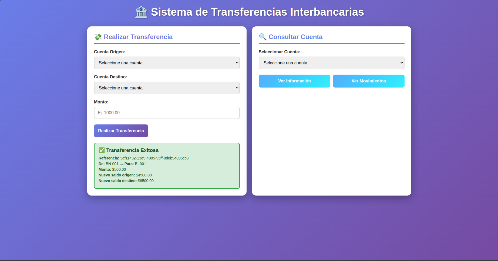
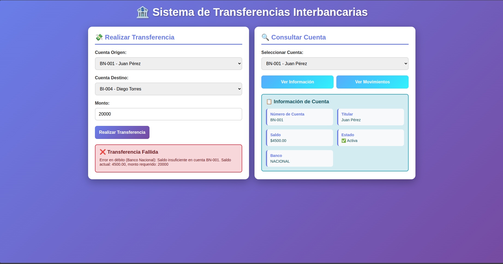
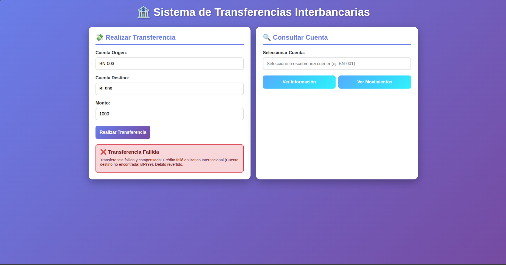
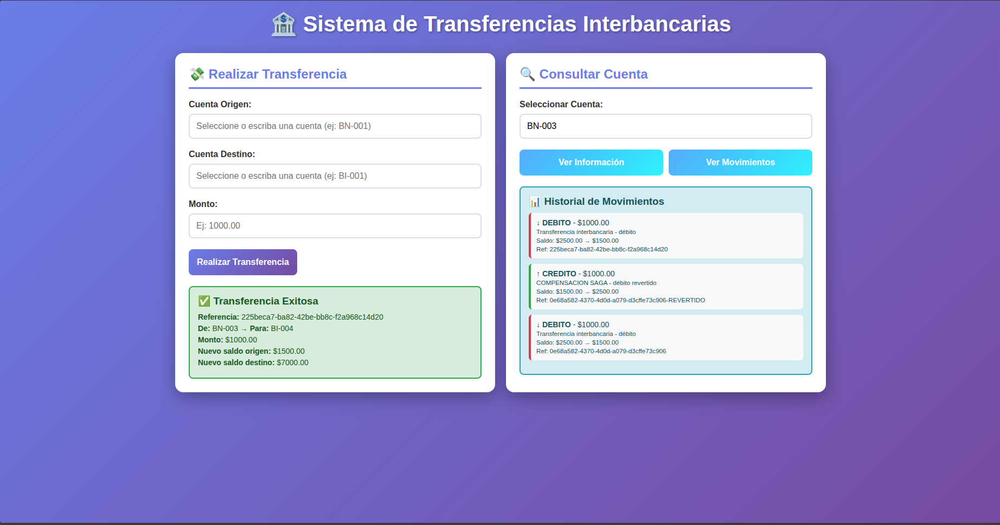
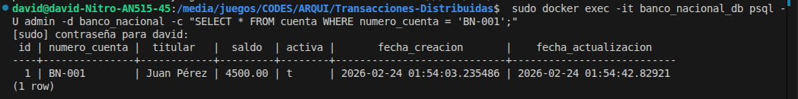
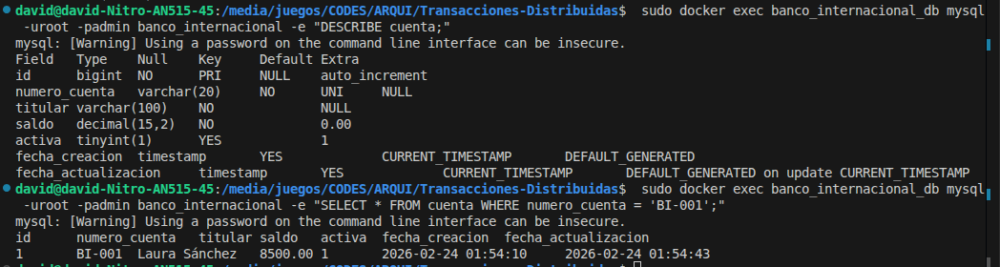
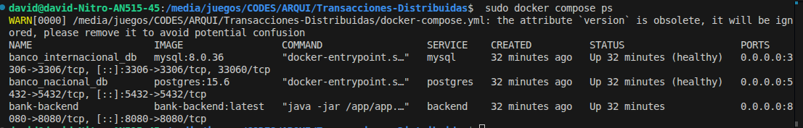

# Transacciones Distribuidas PostgreSQL + MySQL

Este repositorio contiene la arquitectura base para la implementación de un sistema de transferencias interbancarias haciendo uso de **Spring Boot**, **PostgreSQL** y **MySQL**.

## 📌 Arquitectura Implementada

Se establece un sistema de transferencias interbancarias con separación estricta de dominios de datos:
- **Banco Nacional:** Soporte en base de datos PostgreSQL 15 (Puerto 5432).
- **Banco Internacional:** Soporte en base de datos MySQL 8 (Puerto 3306).
- **Backend:** Aplicación Spring Boot conectada a ambas bases de datos, utilizando configuración avanzada de DataSources múltiples y asegurando persistencia separada por contexto.

Las dependencias e infraestructura se encuentran contenidas para un arranque simplificado mediante contenedores Docker, ubicados todos dentro de una red virtual compartida (`bank-network`) para asegurar la correcta comunicación y resolución DNS sin exponer las bases directamente al exterior de forma innecesaria (aunque se mapean los puertos localmente para el desarrollo).

### 🗂 Estructura de Paquetes Relevante
Se separaron las responsabilidades a nivel código para aislar las interacciones con la base de datos:
- `com.bank.backend.repository.nacional`: Dedicado al EntityManagerFactory y repositorios apuntando a PostgreSQL.
- `com.bank.backend.repository.internacional`: Dedicado al EntityManagerFactory y repositorios apuntando a MySQL.

## 🚀 Instrucciones de Instalación y Ejecución

### Prerequisitos
- **Docker** y **Docker Compose** instalados en tu máquina
- Java 17 (solo para desarrollo, no necesario si usas Docker)
- Maven (solo para desarrollo, no necesario si usas Docker)

### 🎯 Inicio Rápido (Recomendado)

Hemos creado scripts automatizados para cada sistema operativo que:
1. ✅ Inician todos los servicios Docker
2. ✅ Esperan a que las bases de datos estén listas
3. ✅ Verifican que Spring Boot haya iniciado

#### 🐧 Linux / macOS

```bash
./start_linux.sh
```

**Nota:** El script requiere permisos de `sudo` para ejecutar comandos de Docker.

#### 🪟 Windows

```cmd
start_windows.bat
```

**Nota:** Ejecutar como usuario normal (no requiere permisos de administrador si Docker está configurado correctamente).

---

### 🔧 Inicio Manual (Alternativa)

Si prefieres controlar cada paso manualmente:

1. **Levantar la infraestructura:**
   ```bash
   # Linux/macOS
   sudo docker compose up -d --build
   
   # Windows (PowerShell o CMD)
   docker compose up -d --build
   ```

2. **Esperar a que los servicios estén listos** (pueden tomar 30-60 segundos):
   - PostgreSQL estará disponible en el puerto **5432**
   - MySQL estará disponible en el puerto **3306**
   - Spring Boot Backend estará en **http://localhost:8080**

3. **Verificar el estado de los servicios:**
   ```bash
   docker compose ps
   ```

4. **Abrir la interfaz web:**
   - Abre el archivo `index.html` en tu navegador preferido
   - O navega a: `file:///ruta/completa/al/proyecto/index.html`

---

### 📊 Servicios Disponibles

Una vez iniciado el sistema, tendrás acceso a:

| Servicio | URL/Puerto | Credenciales |
|----------|-----------|--------------|
| **Interfaz Web** | `index.html` | - |
| **API REST** | `http://localhost:8080/api` | - |
| **PostgreSQL** (Banco Nacional) | `localhost:5432` | admin / admin |
| **MySQL** (Banco Internacional) | `localhost:3306` | root / admin |

---

### 🔍 Verificación de Logs

Para verificar que todo esté funcionando correctamente:

```bash
# Ver logs del backend
docker compose logs -f backend

# Ver logs de PostgreSQL
docker logs banco_nacional_db

# Ver logs de MySQL
docker logs banco_internacional_db

# Ver todos los logs
docker compose logs -f
```

---

### 🛑 Detener los Servicios

```bash
# Detener servicios (mantiene los datos)
docker compose down

# Detener y eliminar volúmenes (borra todos los datos)
docker compose down -v
```

---

### 🔄 Reiniciar desde Cero

Si quieres resetear todas las bases de datos y empezar de nuevo:

```bash
# Linux/macOS
sudo docker compose down -v && sudo docker compose up -d --build

# Windows
docker compose down -v && docker compose up -d --build
```

---

### 🌐 Endpoints API Disponibles

#### Consultas de Cuentas
- `GET /api/cuentas/nacional/{numeroCuenta}` - Información completa de cuenta nacional
- `GET /api/cuentas/nacional/{numeroCuenta}/saldo` - Saldo de cuenta nacional
- `GET /api/cuentas/nacional/{numeroCuenta}/movimientos` - Movimientos de cuenta nacional
- `GET /api/cuentas/internacional/{numeroCuenta}` - Información completa de cuenta internacional
- `GET /api/cuentas/internacional/{numeroCuenta}/saldo` - Saldo de cuenta internacional
- `GET /api/cuentas/internacional/{numeroCuenta}/movimientos` - Movimientos de cuenta internacional

#### Transferencias Interbancarias
- `POST /api/transferencias/nacional-a-internacional` - Transferencia de Banco Nacional → Banco Internacional
- `POST /api/transferencias/internacional-a-nacional` - Transferencia de Banco Internacional → Banco Nacional

**Ejemplo de request:**
```json
{
  "cuentaOrigen": "BN-001",
  "cuentaDestino": "BI-001",
  "monto": 1000.00
}
```

---

### 👥 Cuentas de Prueba

#### Banco Nacional (PostgreSQL)
- **BN-001** - Juan Pérez (Saldo inicial: $5,000)
- **BN-002** - María García (Saldo inicial: $10,000)
- **BN-003** - Carlos Rodríguez (Saldo inicial: $15,000)
- **BN-004** - Ana Martínez (Saldo inicial: $7,500)

#### Banco Internacional (MySQL)
- **BI-001** - Laura Sánchez (Saldo inicial: $8,000)
- **BI-002** - Pedro López (Saldo inicial: $3,000)
- **BI-003** - Sofia Hernández (Saldo inicial: $12,000)
- **BI-004** - Diego Torres (Saldo inicial: $6,000)

---

### ⚙️ Configuración Avanzada

Las propiedades de conexión se pueden sobreescribir vía variables de entorno (ya preparadas en `docker-compose.yml`):
- `SPRING_DATASOURCE_NACIONAL_URL`, `SPRING_DATASOURCE_NACIONAL_USERNAME`, `SPRING_DATASOURCE_NACIONAL_PASSWORD`
- `SPRING_DATASOURCE_INTERNACIONAL_URL`, `SPRING_DATASOURCE_INTERNACIONAL_USERNAME`, `SPRING_DATASOURCE_INTERNACIONAL_PASSWORD`

Los logs están configurados en nivel `DEBUG` para validar las conexiones JPA exitosas y confirmar que ambos DataSources están activos.

## ⚖️ Decisiones y Enfoque Arquitectónico (Trade-offs)

### ¿Por qué no se usa XA / 2PC (Two-Phase Commit)?
El protocolo *Two-Phase Commit (2PC)* obliga a un bloqueo temporal sincrónico (Coordinador bloquea todos los recursos hasta que todos validen). En un contexto de bancos diferentes e independientes, generar bloqueos *cross-database* introduce latencia inaceptable, acoplamiento alto, baja tolerancia a caídas prolongadas de nodos, y bloqueos de red perjudiciales que degradan el throughput dramáticamente. Además, algunos drivers y bases de datos modernas limitan o desaconsejan soporte XA estricto por rendimiento.

### ¿Por qué se implementa SAGA?
El patrón **SAGA**, especialmente en su variante orquestada o coreografiada, resuelve las transacciones distribuidas como una secuencia de transacciones *locales*, que son inmediatamente commiteadas. 
- Permite que cada banco persista sus transacciones en sus bases de datos (PostgreSQL para Nacional, MySQL para Internacional) de manera independiente.
- Si un paso del SAGA falla (ej. el banco destino rechaza la transacción por fondos o la cuenta no existe), el sistema ejecuta **transacciones compensatorias** sobre el banco origen para revertir lógicamente el saldo (ej. se deposita de vuelta el dinero al origen).
- Fomenta sistemas reactivos, tolerantes a fallos (disponibilidad) y evita bloqueos largos de base de datos.

### Trade-offs entre Consistencia y Disponibilidad
- **Teorema CAP:** Hemos preferido un modelo orientado a **Eventual Consistency** (Consistencia Eventual) y alta **Disponibilidad**. 
- Bajo 2PC garantizamos "ACID fuerte" a nivel global (Consistency), sacrificando fuertemente Availability si una BD de la red está lenta o caída.
- Bajo SAGA hay picos de inconsistencia semántica muy breves (el dinero sale del Banco Nacional y puede tomar un instante hasta procesarse y acreditarse en el Banco Internacional). Sin embargo, mantenemos alta disponibilidad para procesamiento de ambas bases y manejamos de forma segura las confirmaciones/compensaciones, favoreciendo el comportamiento real en sistemas bancarios y microservicios modernos.

### Separación de Responsabilidades
Para soportar SAGA dentro de la misma capa de aplicación o en microservicios, el primer paso es **aislar el stack de datos**. Cada Base de Datos tiene su propia configuración `@Configuration`, su propio DataSource (`NacionalDataSourceConfig`, `InternacionalDataSourceConfig`), su propio `EntityManagerFactory` y su gestor de transacciones independiente. Al separar los paquetes `repository.nacional` e `repository.internacional`, nos aseguramos que una transacción mal armada no use accidentalmente la conexión del otro banco, pilar fundamental para luego construir un servicio orquestador confiable.

---

## 📸 Capturas de Pantalla de Pruebas

### 🖥️ Interfaz Web
La interfaz web proporciona una forma intuitiva de realizar transferencias interbancarias y consultar el estado de las cuentas.

**Pantalla principal con formulario de transferencias:**
- Selector de cuenta origen (Banco Nacional o Internacional)
- Selector de cuenta destino (Banco Nacional o Internacional)
- Campo de monto con validación
- Botón para ejecutar la transferencia



### ✅ Transferencia Exitosa: Nacional → Internacional
**Prueba:** Transferencia de $500 desde BN-001 (Juan Pérez) a BI-001 (Laura Sánchez)

**Resultado esperado:**
- ✅ Saldo de BN-001 reducido en $500 (de $5,000 a $4,500)
- ✅ Saldo de BI-001 incrementado en $500 (de $8,000 a $8,500)
- ✅ Movimiento tipo DEBITO registrado en PostgreSQL
- ✅ Movimiento tipo CREDITO registrado en MySQL
- ✅ Ambas transacciones con la misma referencia UUID



### ✅ Transferencia Exitosa: Internacional → Nacional
**Prueba:** Transferencia de $300 desde BI-002 (Pedro López) a BN-002 (María García)

**Resultado esperado:**
- ✅ Saldo de BI-002 reducido en $300 (de $3,000 a $2,700)
- ✅ Saldo de BN-002 incrementado en $300 (de $10,000 a $10,300)
- ✅ Transacción distribuida ejecutada correctamente


### ❌ Manejo de Errores: Fondos Insuficientes
**Prueba:** Intentar transferir $20,000 desde BN-001 (saldo actual: $4,500)

**Resultado esperado:**
- ❌ Transferencia rechazada con error HTTP 400
- ✅ Mensaje descriptivo: "Fondos insuficientes en cuenta origen"
- ✅ Sin cambios en ninguna base de datos (rollback automático)
- ✅ Sin movimientos registrados



**Respuesta de la API:**
```json
{
  "timestamp": "2026-02-23T10:30:45.123",
  "status": 400,
  "error": "Bad Request",
  "message": "Fondos insuficientes en cuenta origen BN-001",
  "path": "/api/transferencias/nacional-a-internacional"
}
```

### ❌ Compensación SAGA: Cuenta Destino Inválida
**Prueba:** Transferir desde BN-003 a cuenta inexistente "BI-999"

**Resultado esperado:**
- ✅ Paso 1 ejecutado: Débito exitoso en BN-003
- ❌ Paso 2 fallido: Cuenta BI-999 no existe
- ✅ Compensación activada: Reverso automático del débito
- ✅ Saldo de BN-003 restaurado al valor original
- ✅ Movimiento de compensación registrado con descripción "Reversión de transferencia fallida"



**Logs del Backend:**
```
DEBUG - Iniciando transferencia: BN-003 -> BI-999 por $1000.00
DEBUG - Paso 1: Débito en Banco Nacional completado
ERROR - Paso 2: Cuenta destino BI-999 no encontrada
WARN  - Iniciando compensación SAGA
DEBUG - Revirtiendo débito en Banco Nacional
INFO  - Compensación completada. Saldo restaurado en BN-003
```

### 📊 Consulta de Movimientos
**Prueba:** Consultar historial de movimientos de cuenta BN-001

**Resultado:**
- Lista cronológica de todos los débitos y créditos
- Información detallada: fecha, tipo, monto, saldo anterior y nuevo
- Referencia UUID para rastrear transferencias distribuidas



### 🗄️ Verificación en Bases de Datos

**PostgreSQL (Banco Nacional):**

Comando para acceder a PostgreSQL y ejecutar consultas:
```bash
# Conectar a PostgreSQL
docker exec -it banco_nacional_db psql -U admin -d banco_nacional

# Comandos SQL para ejecutar dentro de psql:
SELECT * FROM cuenta WHERE numero_cuenta = 'BN-001';
SELECT * FROM movimiento WHERE cuenta_id = 1 ORDER BY fecha DESC;

# Para salir de psql:
\q
```

O ejecutar directamente sin entrar al shell:
```bash
docker exec -it banco_nacional_db psql -U admin -d banco_nacional -c "SELECT * FROM cuenta WHERE numero_cuenta = 'BN-001';"
docker exec -it banco_nacional_db psql -U admin -d banco_nacional -c "SELECT * FROM movimiento WHERE cuenta_id = 1 ORDER BY fecha DESC;"
```



**MySQL (Banco Internacional):**

Comando para acceder a MySQL y ejecutar consultas:
```bash
# Conectar a MySQL
docker exec -it banco_internacional_db mysql -uroot -padmin banco_internacional

# Comandos SQL para ejecutar dentro de mysql:
SELECT * FROM cuenta WHERE numeroCuenta = 'BI-001';
SELECT * FROM movimiento WHERE cuentaId = 1 ORDER BY fecha DESC;

# Para salir de mysql:
exit
```

O ejecutar directamente sin entrar al shell:
```bash
docker exec -it banco_internacional_db mysql -uroot -padmin banco_internacional -e "SELECT * FROM cuenta WHERE numeroCuenta = 'BI-001';"
docker exec -it banco_internacional_db mysql -uroot -padmin banco_internacional -e "SELECT * FROM movimiento WHERE cuentaId = 1 ORDER BY fecha DESC;"
```



### 🐳 Docker Containers Status
**Prueba:** Verificar que todos los servicios estén corriendo

```bash
$ docker compose ps
NAME                  STATUS          PORTS
banco_nacional_db     Up 2 minutes    0.0.0.0:5432->5432/tcp
banco_internacional_db Up 2 minutes   0.0.0.0:3306->3306/tcp
bank-backend          Up 1 minute     0.0.0.0:8080->8080/tcp
```



---

## 💭 Reflexión Final

La implementación de este sistema de transacciones distribuidas representó un desafío técnico significativo que permitió comprender en profundidad las complejidades de los sistemas bancarios modernos. La decisión más crítica fue elegir el patrón SAGA sobre el tradicional Two-Phase Commit (2PC), una elección que refleja las prioridades de arquitecturas orientadas a microservicios actuales.

El patrón SAGA demostró ser superior en este contexto porque prioriza la disponibilidad y la tolerancia a fallos sobre la consistencia estricta instantánea. En sistemas bancarios reales, es preferible que las operaciones se completen eventualmente con mecanismos de compensación robustos, en lugar de mantener recursos bloqueados esperando confirmaciones sincrónicas que pueden fallar ante problemas de red o latencia entre sistemas heterogéneos. La implementación de transacciones compensatorias (`revertirDebito` y `revertirCredito`) garantiza la integridad del sistema incluso cuando pasos intermedios fallan.

La arquitectura multi-datasource de Spring Boot permitió mantener la separación estricta entre los dos bancos, cada uno con su propio gestor de transacciones y EntityManagerFactory. Esta segregación no solo refleja la realidad de instituciones financieras independientes, sino que facilita la escalabilidad horizontal: cada banco puede crecer, optimizarse o migrar su infraestructura sin afectar al otro. El uso de bloqueos pesimistas (PESSIMISTIC_WRITE) previene condiciones de carrera en escenarios de alta concurrencia, crucial para mantener la consistencia de saldos.

Dockerizar toda la infraestructura simplificó dramáticamente el despliegue y las pruebas, permitiendo replicar entornos de producción localmente. Los scripts de inicio automatizados reducen la fricción para nuevos desarrolladores y demuestran buenas prácticas de DevOps.

Esta experiencia evidencia que los sistemas distribuidos modernos requieren abandonar paradigmas tradicionales de transacciones monolíticas. El trade-off entre consistencia fuerte y disponibilidad no es una debilidad, sino una característica diseñada conscientemente para sistemas resilientes que deben operar en entornos imperfectos de red y alta carga.

---
